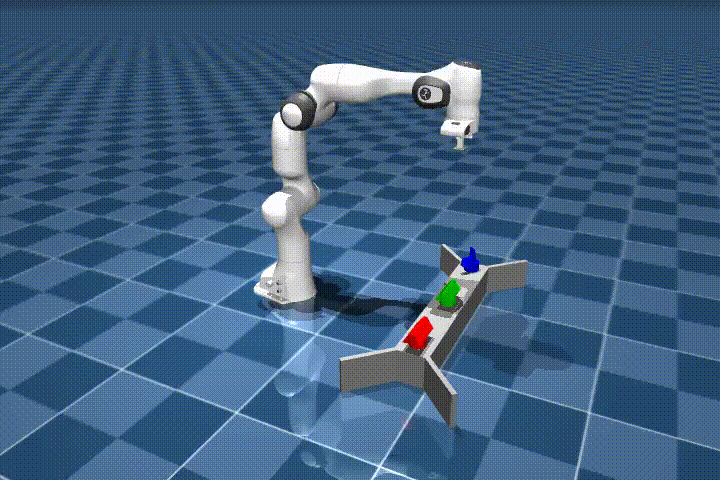

# Tactile 3D Exploration



## Contents
1. [arduino_readout](arduino_readout) contains the Arduino readout scheme for event-based tactile sensors.
2. [CAD](CAD/) contains the CAD files (AutoDesk Inventor).
3. [data](data/) contains the generated touch data of edges.
4. [piezoresistive_sensor](piezoresistive_sensor/) contains the KiCAD project of the sensor design.
5. [python](python/) contains the python scripts of data generation (MuJoCo) and tactile encoding study.
6. [SpikyMotion](https://github.com/wngfra/SpikyMotion) contains the ROS2 server for neuromorphic robotic control.
7. [tac3d](tac3d/) contains the [ROS2](https://docs.ros.org/en/humble/index.html) packages for active tactile exploration simulation.

## Features
- Intel Lohi KapohoBay support(beta)
- Online simulation in [MuJoCo](https://mujoco.org/) with [ROS2](https://www.ros.org/) interfaces
- Asynchronous neural simulation in [Nengo](https://www.nengo.ai/)

## Notes
1. Copy NxSDK tarballs to [docker](docker/) directory, setup the kernel before runing the container
  ```bash
    sudo rmmod ftdi_sio # Remove FTDI interfaces from kernel
  ```
2. Launch the active exploration simulation in the docker container
  ```bash
    docker compose up
  ```