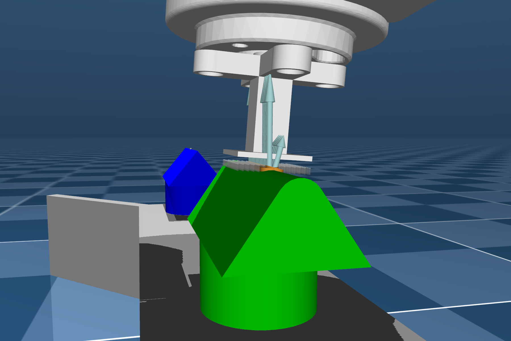

# Tactile 3D Exploration



## Contents
1. [arduino_readout](arduino_readout) contains the Arduino readout scheme for event-based tactile sensors.
2. [CAD](CAD/) contains the CAD files (AutoDesk Inventor).
3. [piezoresistive_sensor](piezoresistive_sensor/) contains the KiCAD project of the sensor design.
4. [python](python/) contains the python scripts and Jupyter notebooks of data generation (MuJoCo) and tactile encoding study.
5. [tac3d](tac3d/) contains the [ROS2](https://docs.ros.org/en/humble/index.html) packages for active tactile exploration simulation.

## Features
- Intel Loihi support(beta)
- Online simulation in [MuJoCo](https://mujoco.org/) with [ROS2](https://www.ros.org/) interfaces
- Asynchronous neural simulation in [Nengo](https://www.nengo.ai/)

## Loihi
1. Copy NxSDK tarballs to [loihi](loihi/) directory, setup the kernel before running the container
  ```bash
    sudo rmmod ftdi_sio # Remove FTDI interfaces from kernel
  ```
2. Launch the active exploration simulation in the docker container
  ```bash
    cd loihi
    docker compose up
  ```
## Reference
[1] A. Parvizi-Fard, M. Amiri, D. Kumar, M. M. Iskarous, and N. V. Thakor, “A functional spiking neuronal network for tactile sensing pathway to process edge orientation,” Sci Rep, vol. 11, no. 1, p. 1320, Dec. 2021, doi: 10.1038/s41598-020-80132-4.

[2] X. She, S. Dash, D. Kim, and S. Mukhopadhyay, “A Heterogeneous Spiking Neural Network for Unsupervised Learning of Spatiotemporal Patterns,” Front. Neurosci., vol. 14, p. 615756, Jan. 2021, doi: 10.3389/fnins.2020.615756.

[3] J. A. Pruszynski and R. S. Johansson, “Edge-orientation processing in first-order tactile neurons,” Nat Neurosci, vol. 17, no. 10, pp. 1404–1409, Oct. 2014, doi: 10.1038/nn.3804.

[4] J. A. Pruszynski, J. R. Flanagan, and R. S. Johansson, “Fast and accurate edge orientation processing during object manipulation,” eLife, vol. 7, p. e31200, Apr. 2018, doi: 10.7554/eLife.31200.

[5] J. Platkiewicz, “Haptic Edge Detection Through Shear,” Scientific Reports, p. 10.

[6] J. M. Brader, W. Senn, and S. Fusi, “Learning Real-World Stimuli in a Neural Network with Spike-Driven Synaptic Dynamics,” Neural Computation, vol. 19, no. 11, pp. 2881–2912, Nov. 2007, doi: 10.1162/neco.2007.19.11.2881.

[7] T. Barbier, C. Teuliere, and J. Triesch, “Spike timing-based unsupervised learning of orientation, disparity, and motion representations in a spiking neural network,” in 2021 IEEE/CVF Conference on Computer Vision and Pattern Recognition Workshops (CVPRW), Nashville, TN, USA, Jun. 2021, pp. 1377–1386. doi: 10.1109/CVPRW53098.2021.00152.